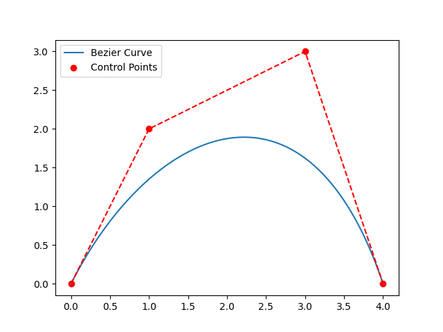
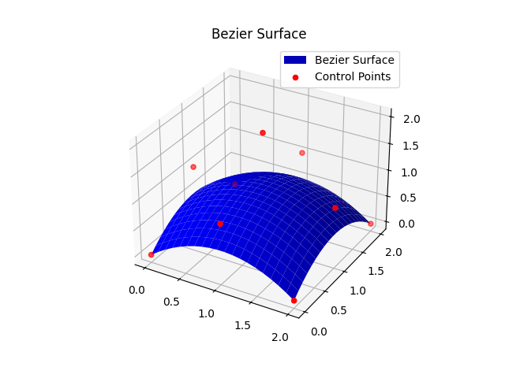

# Bezier Curve and Surface 

## Experiment Purpose
The purpose of this experiment is to deepen the understanding of free-form curve and surface modeling using Bezier curves and surfaces. This involves mastering relevant algorithms and familiarizing oneself with the methods of Bezier curve and surface modeling.

## Summary
This experiment demonstrates the creation and visualization of Bezier curves and surfaces. A Bezier curve is generated from a set of control points, showing how these points influence the curve's shape without the curve passing through intermediate points (except the endpoints). Similarly, a Bezier surface is constructed using a grid of control points, forming a smooth, continuous surface influenced by the control points. Both the curve and the surface plots effectively illustrate the properties and behavior of Bezier forms.

## Major Classes and Functions

### BezierCurve Class
- **__init__(self, control_points):** Initializes the Bezier curve with control points.
- **bernstein_poly(self, i, n, t):** Computes the Bernstein polynomial value.
- **curve(self, num_points=100):** Computes the Bezier curve points.
- **plot(self, num_points=100, save_path=None):** Plots the Bezier curve and optionally saves the plot to a file.

### BezierSurface Class
- **__init__(self, control_points):** Initializes the Bezier surface with control points.
- **bernstein_poly(self, i, n, t):** Computes the Bernstein polynomial value.
- **surface(self, num_points=20):** Computes the Bezier surface points.
- **plot(self, num_points=20, save_path=None, title="Bezier Surface"):** Plots the Bezier surface and optionally saves the plot to a file.

### Main Script
- **main():** The entry point of the program. It demonstrates the usage of the `BezierCurve` and `BezierSurface` classes by initializing them with sample control points, generating the curves and surfaces, and plotting the results.

## Setup
To run this code, follow the steps below:

1. **Clone the Repository:**
   ```bash
   git clone https://github.com/Hetawk/bezier_curve_and_surface.git
   cd bezier_curve_and_surface
   ```

2. **Install Dependencies:**
   Ensure you have Python installed (version 3.6+ recommended). Then, install the required packages:
   ```bash
   pip install -r requirements.txt
   ```

3. **Run the Main Script:**
   ```bash
   python main.py
   ```

## Outputs

### Bezier Curve


### Bezier Surface


## Directory Structure
```
bezier_curve_and_surface/
│
├── bezier_curve.py
├── bezier_surface.py
├── main.py
├── requirements.txt
├── bezier_curve.png
├── bezier_surface.png
└── README.md
```
